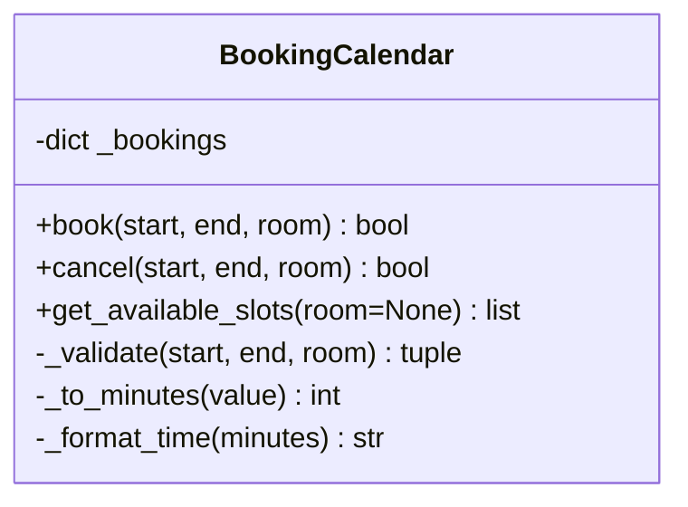

# 14. Ejercicio de CoT: BookingCalendar

Jonathan Ricardo Serna Galina · 20074902

Sistema de reservas para salas de reuniones en un mismo día. Código generado
con asistencia de IA a partir de la consigna proporcionada por el estudiante.

## Ejecución (Python 3.9 o superior)

```sh
python3 main.py
python3 cot_test.py
python3 -m unittest -v test_booking_calendar.py
```

No requiere dependencias externas. Ejecutar desde esta carpeta.

## Contrato

- `book(start, end, room) -> bool`: rechaza datos inválidos y traslapes.
- `cancel(start, end, room) -> bool`: exige coincidencia exacta.
- `get_available_slots(room=None) -> list[tuple]`: imprime tabla y devuelve filas.
- Horas enteras 0–24 o cadenas HH:MM; 24:00 solo como fin.
- Intervalos [inicio, fin), de modo que 09:00–10:00 y 10:00–11:00 son compatibles.
- Salas independientes; se recortan espacios externos y se distinguen mayúsculas.
- Jornada completa 00:00–24:00. Sin fechas, persistencia ni interfaz web.
- Las salas cuya última reserva se cancela siguen registradas y quedan libres.
- Consultar una sala desconocida muestra el día libre, sin registrarla.

## Verificación

El archivo `cot_test.py` del docente se conserva sin modificaciones.
Contiene dos expresiones sin `assert` para horarios inválidos y llama a
`run_tests()` dos veces cuando se ejecuta directamente. Por ello, el mensaje
`All tests passed.` aparece dos veces. Los 13 tests de unittest complementan
esas limitaciones y verifican datos inválidos, traslapes, minutos, cancelación,
independencia de salas, tablas y disponibilidad. Los tres archivos nuevos
pasan pycodestyle con su configuración predeterminada.

## Diagrama de clases



## Evidencia

`evidencia_demo.txt`, `evidencia_docente.txt` y `evidencia_tests.txt` contienen
salidas reales de ejecución. El segundo PDF es una síntesis técnica de la
solución, no una transcripción del razonamiento interno del modelo.
