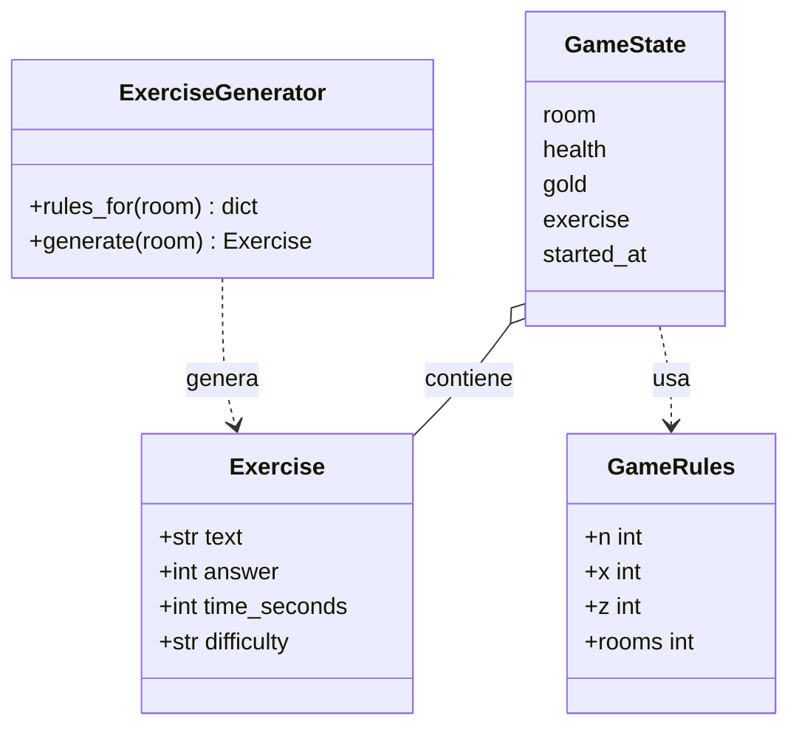
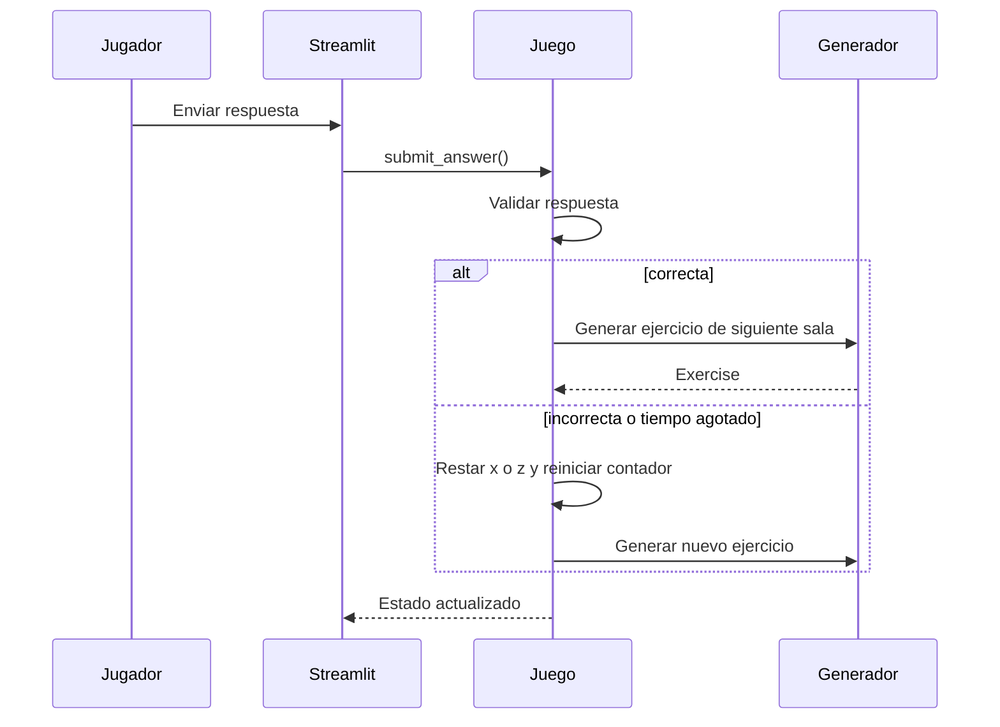

# Diagramas de clases

```mermaid
classDiagram
    class Exercise {
      +str text
      +int answer
      +int time_seconds
      +str difficulty
    }
    class ExerciseGenerator {
      +rules_for(room) dict
      +generate(room) Exercise
    }
    class GameState {
      room
      health
      gold
      exercise
      started_at
    }
    class GameRules {
      +n int
      +x int
      +z int
      +rooms int
    }
    ExerciseGenerator ..> Exercise : genera
    GameState o-- Exercise : contiene
    GameState ..> GameRules : usa
```

```mermaid
sequenceDiagram
    participant J as Jugador
    participant U as Streamlit
    participant G as Juego
    participant E as Generador
    J->>U: Enviar respuesta
    U->>G: submit_answer()
    G->>G: Validar respuesta
    alt correcta
      G->>E: Generar ejercicio de siguiente sala
      E-->>G: Exercise
    else incorrecta o tiempo agotado
      G->>G: Restar x o z y reiniciar contador
      G->>E: Generar nuevo ejercicio
    end
    G-->>U: Estado actualizado
```
