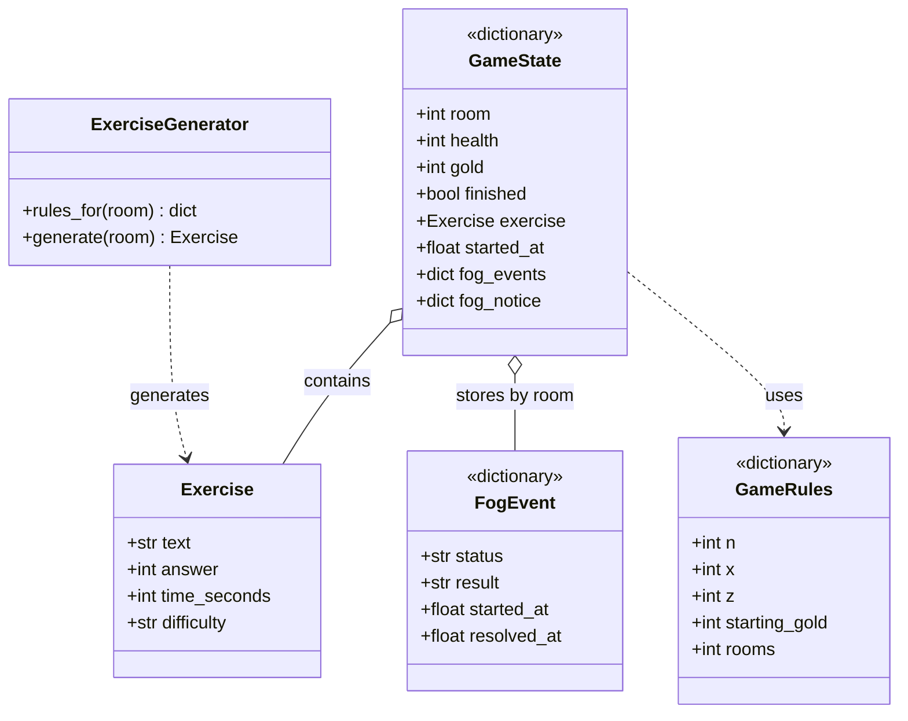
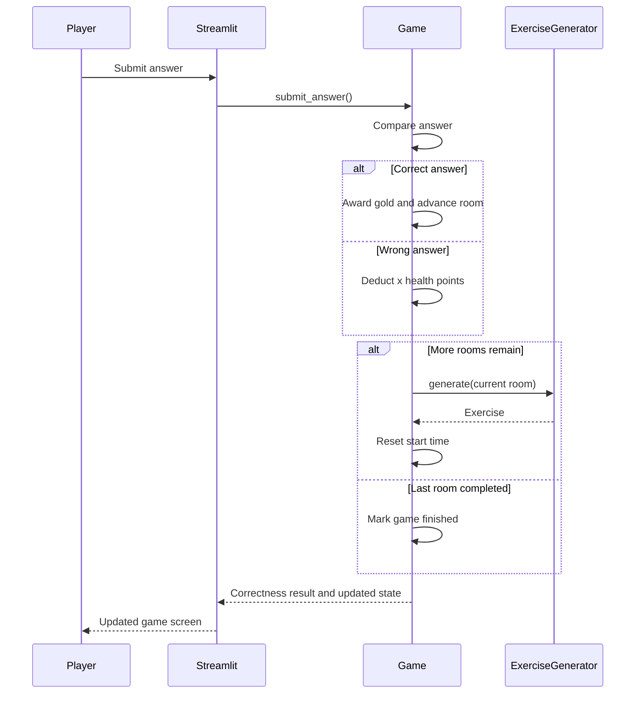

# Class and Interaction Diagrams

`Exercise` and `ExerciseGenerator` are the only Python classes. `GameState`,
`FogEvent`, and `GameRules` below describe dictionary contents, not additional
classes.





For an expired timer, the interface calls `timeout()` instead of
`submit_answer()`. It deducts `z` health points and starts another exercise
only while health remains. The interface hides the answer form after defeat
or victory and keeps the exit and restart controls available.

## Fog event flow

Each room's 1-in-3 event roll and roulette result are stored in the game state,
so Streamlit reruns reuse them. The timer stays paused while the roulette is
offered or spinning.

`fog_notice` is added only after a free pass to announce the cleared room.

```mermaid
sequenceDiagram
    participant P as Player
    participant U as Streamlit
    participant F as Fog
    participant G as Game
    P->>U: Enter a room
    U->>F: check_room_event(state, room)
    alt No event
      U->>G: Refresh the room timer
    else Fog event offered
      U-->>P: Show roulette option; pause timer
      P->>U: Start roulette
      U->>F: start_roulette(state, room)
      loop While spinning
        U->>F: resolve_roulette(state, room)
        U-->>P: Animate pass and enemy outcomes
      end
      alt Pass
        F->>G: Advance one room without gold
      else Enemy
        F->>G: Keep room and current exercise
        U->>G: Start the normal room timer
      end
    end
```
