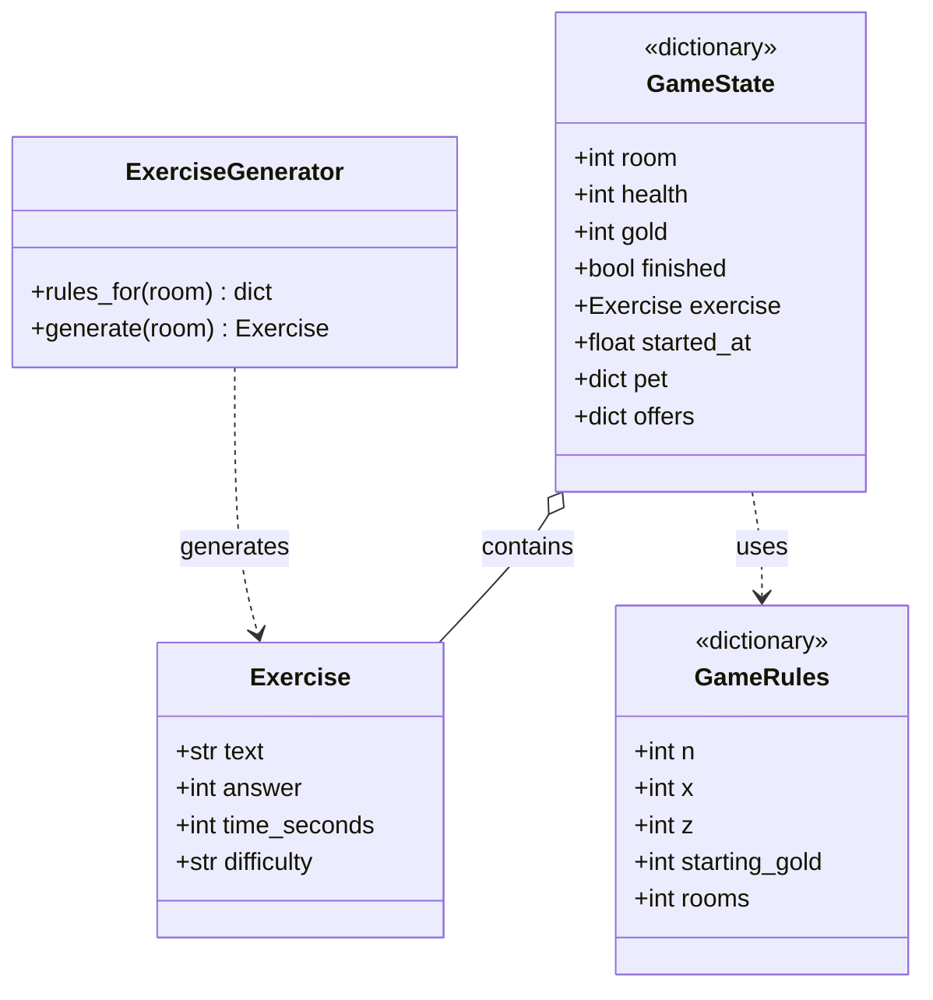
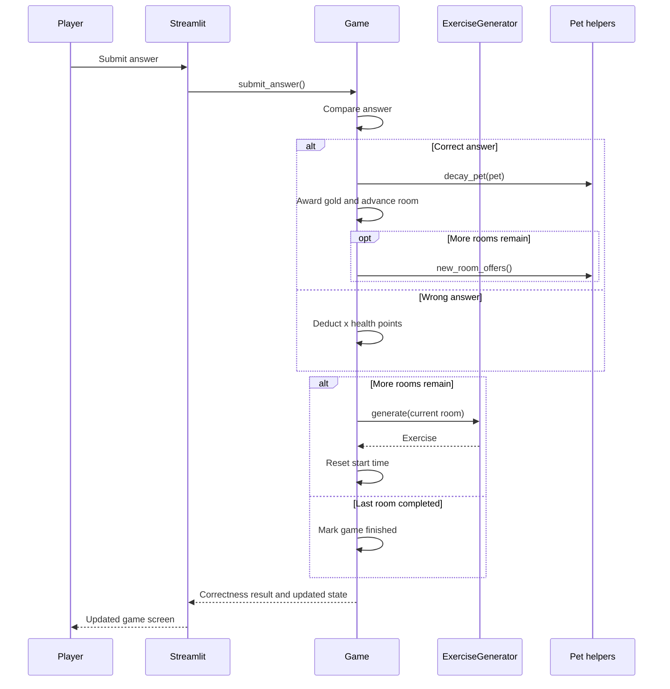

# Class and Interaction Diagrams

`Exercise` and `ExerciseGenerator` are the only Python classes. `GameState`
and `GameRules` below describe dictionary contents, not additional classes.

For an expired timer, the interface calls `timeout()` instead of
`submit_answer()`. It deducts `z` health points and starts another exercise
only while health remains. Pet meters and offers stay unchanged on timeout or
rerun. A purchase restores one meter, while clearing a room decays all meters
and creates new offers when another room remains. The interface hides the
answer form after defeat or victory and keeps the exit and restart controls
available.
